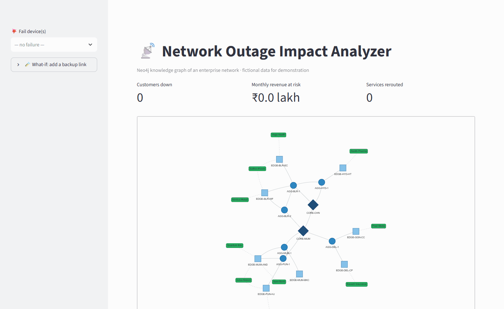
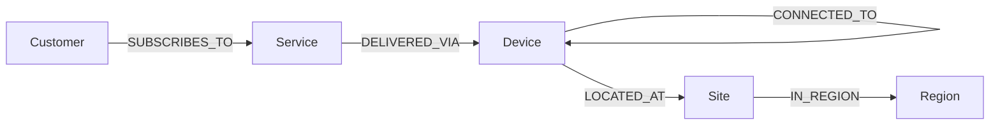

# 📡 OutageGraph — Network Outage Impact Analyzer

**▶ Live demo:** https://outagegraph-rxxa2amdtpqnuq3juscjgj.streamlit.app/



Fail any router in an enterprise network and instantly see **which customers go down, how much monthly revenue is at risk, who survives on a backup path, and which devices are single points of failure**.

Built with **Neo4j · Cypher · Python · Streamlit · pyvis · networkx**.

## Why a graph?
"Can this customer still reach the core if router X dies?" is a path question of unknown length. In SQL that means recursive joins; in Cypher it is one pattern:

```cypher
MATCH p = (edge)-[:CONNECTED_TO*..6]-(core:Device {type:'core'})
WHERE none(n IN nodes(p) WHERE n.id IN $failed)
RETURN p
```

## Data model

- **Core → aggregation → edge** routers. A service is UP if any of its access devices can still reach any core router.
- **Service is separate from Customer**, so partial outages show up, e.g. "MPLS down, Internet still up".
- **Dual-homing** is simply two `DELIVERED_VIA` relationships.

## Features
| Feature | What it does |
|---|---|
| Failure simulation | Fail one or more devices; see customers down, ₹ revenue at risk, and rerouted services with old/new path and latency change |
| What-if link | Add a temporary backup link and watch the risk drop |
| Single points of failure | Fails every device in turn and ranks them by revenue at risk |
| Centrality analysis | Betweenness centrality and articulation points (Neo4j GDS when available, networkx otherwise) |

## Key results
| Scenario | Customers down | Revenue at risk / month |
|---|---|---|
| Mumbai core fails | 6 | ₹27.7 lakh |
| + one Pune ↔ Chennai backup link | 2 | ₹9.2 lakh |
| Bengaluru aggregation fails | 1 (dual-homed customers survive) | ₹6.0 lakh |
| Chennai core fails | 0 (all traffic reroutes) | ₹0 |

One extra link cuts the worst-case revenue at risk by **67%**.

## Run it
**Prerequisites:** Python 3.10+ and a free [Neo4j AuraDB](https://neo4j.com/cloud/aura-free/) instance.

```bash
python -m venv .venv
.venv\Scripts\activate            # macOS/Linux: source .venv/bin/activate
pip install -r requirements.txt
cp .env.example .env              # add your Neo4j URI, user and password
python -m src.load_data           # load the graph
streamlit run app.py              # open http://localhost:8501
```
On Windows you can simply run `run.bat` (or `run.bat load` to reload the data first).

**Deploy:** on [Streamlit Community Cloud](https://share.streamlit.io), create an app from this repo (`app.py`) and add `NEO4J_URI`, `NEO4J_USER` and `NEO4J_PASSWORD` under *App settings → Secrets*. Credentials never go in the repo.

## Project structure
```
├── app.py              Streamlit UI
├── data/network.json   Sites, devices, links, customers, services
├── src/db.py           Neo4j driver helpers
├── src/load_data.py    Idempotent loader (constraints + UNWIND/MERGE)
├── src/impact.py       Impact engine, what-if links, centrality
└── run.bat             One-click launcher
```

## Limitations
- Company names and topology are fictional and simplified.
- Path choice uses hop count; latency is reported but capacity and congestion are not modelled.
- The single-point-of-failure ranking is brute force, fine for a small network. At scale it would move to Neo4j Graph Data Science.
